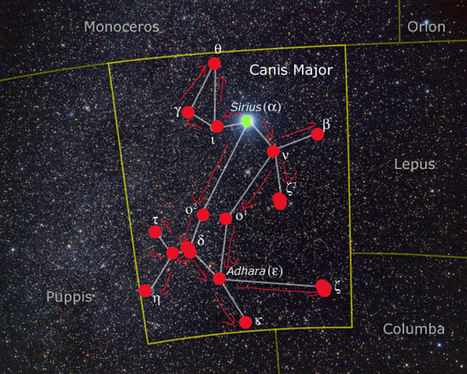

# Решение

Созвездие Большого Пса из GitHub аккаунтов, связанные подписчиками.

- vrnctf{ - D0g-St4r - Alpha Canis Majoris / α Canis Majoris / Sirius / Seirios / Dog Star
- th3_co - tianlangs-herald - Beta Canis Majoris / β Canis Majoris / Mirzam / Al-Murzim / The Herald / Pheasant Cock / Oupo
- Nst3ll - R0ndonia - Gamma Canis Majoris / Muliphen
- ation_ - Virgin-3 - Delta Canis Majoris / δ Canis Majoris / Wezen / Thalath al Adzari / Tertia Virginum
- 0f_c4n - AoulAdzari - Epsilon Canis Majoris / ε Canis Majoris / Adhara / Aoul al Adzari / Seventh Star of Bow and Arrow / Hú Shǐ qī
- is_maj - Al-Agrib4h - Zeta Canis Majoris / ζ Canis Majoris / Furud /  Phurud  / al-ʼaghribah / the ravens
- 0r_is_ - al-adhraa - Eta Canis Majoris / Aludra
- gl4d_t - theta-a-theta - Theta Canis Majoris / θ Canis Majoris
- o_m3et - SAO-152126  - Iota Canis Majoris / ι Canis Majoris / SAO 152126
- _new_fr - 8-of-B0ws-and-Arr0ws - Kappa Canis Majoris / κ Canis Majoris / the Eighth Star of Bow and Arrow
- 13nd_4n - W1ldC0ckerel - Nu2 Canis Majoris / ν2 Canis Majoris /  Wild Cockerel
- d_inv1 - Xi-2 - Xi2 Canis Majoris / ξ2 / Ξ2
- tes_y0 - R3d-Nucl3ar-Sup3rgiant-1 - Omicron1 Canis Majoris / ο1 Canis Majoris / HD 50877
- u_to_j - ThanihalAdzari - Omicron2 Canis Majoris / ο2 Canis Majoris / Thanih al Adzari
- 0in_th - M3xicanJumper - Tau Canis Majoris / τ Canis Majoris / Mexican Jumping Star
- 3_hunt} - Omega-28 - Omega Canis Majoris / ω Canis Majoris / 28 Canis Majoris / HD 56139

vrnctf{th3_const3llation_0f_c4nis_maj0r_is_gl4d_to_m3et_new_fr13nd_4nd_inv1tes_y0u_to_j0in_th3_hunt}

